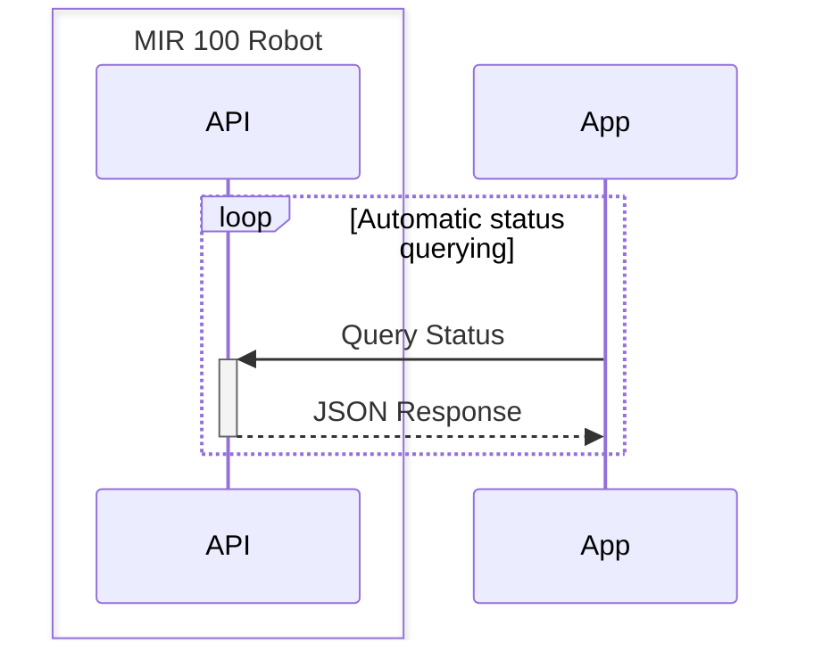
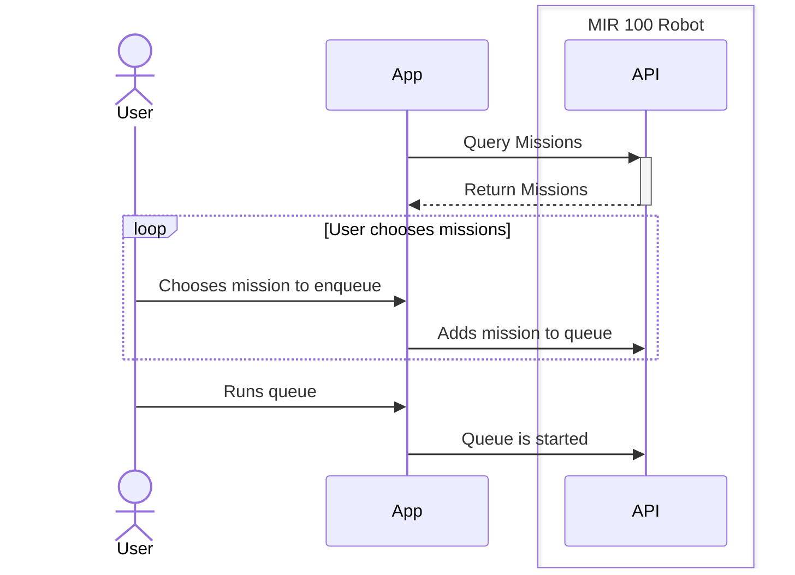

# MIR Application Docs
This app is built with the [Kotlin Multiplatform](https://kotlinlang.org/docs/multiplatform.html) and currently 
targets *Android* and will have in the future an *iOS* build with desktop builds for *Linux*, *MacOS* and *Windows*.

## Main dependencies:
- JetBrains Compose
- Material 3
- KTOR with CIO Client
- Serialization (JSON)
- Datastore
- Lifecycle Viewmodel

## Objectives
- View, create and edit maps and missions on the robot
- Enqueue and run missions
- View status of the robot
- Manual control of the robot
- Access streams from the cameras (may not be technically possible due to API limitations)

## Project Structure
Being this app a Kotlin Multiplatform application, the project is structured as follows:
- Root `build.gradle.kts` containing root level dependencies and compilation plugins
- Root Folder `iosApp` contains the Swift code for the iOS build
- Folder `composeApp` containing the main application code
  - `build.gradle.kts` contains the project's dependencies and specific build configurations for each platform target
  - Folder `src`
    - Folder `androidMain` contains the platform-specific code for Android
    - Folder `desktopMain` contains the JVM desktop platform
    - Folder `iosMain` contains the platform-specific code for iOS in Kotlin

## Context Diagram
[![](https://mermaid.ink/img/pako:eNqdV21v4jgQ_iuWxUpUoigBWijSfeBtq-oOqVe60u0KaeUkDvg22Mh2tuUq_vuNnTgkEOh24UPw5Hn8zHjGY_OGQxFRPMST3kRwTV_1kiP4kDB8ZjqhQzR_eEKj7TZhIdFM8OL1lKpQnrxGkx6aMrKSZLPMsdrMc4J7lOJfGmoHeqRSCd5MFZUttMRf4LnE5tc95VSyEBkLEjHSa2rmWeIrR13slKab72OR8ojIXTPwDK_sMr5Cbxn2gG-SA-AEbwx_Cp0wjuZpotk2IToWclMom3n2zoGDsm-IJlLf89CTCITO5lJWstaP77NX3ZQGaoAlTlnHPHIt9kSTfJmOIoAVUgUpw1UQhcgD5FnGJMzh5vvpU-7UzLzbSqbo8YKOCf_hTF4eSkErpTBMlRYbKkeOxPgKTXIjGmXBjZCDuZwGgGyhF6bXaGsnIom1mVIDVa3a1tlLiuNaxfE5nl15x53UcieZtxGUer5Ul_SntXNML0ecTflu3EfKeQ1nj9GoyCqnGjkPFnnRWfUkES-qcEEhLdBPRl8Q46ausy1JApFq4xqTVReg1HiENuQHRVuy29BzXtUWj39cPHntHHFdTNPA5iUbzOx-IuAk9BNaG9lCC0kVIkni1jUEg_XfQE_jK9agVYpPS8IVCQ0MRlSHtfHV9JrOcXSduq1xmrJyqWQmszWu3uONa3hjV2BZl_n1DYU4tHsETY6266T35-M_ZMjum9n1hrAEqVJansEDZisSZOcslEKJWKPZa7gmfEURLVNq5V055ELTmsinaEo0CYiiv7sE9Vk-pLd7nN5uphRUa_lM0v5OaUpz_z_X-P8ZWcR559uXSsJyS6m4r1G4f0_hoy3XlkXFUh3v3fmWPe2b7CwqnQvltlU5tUrwA6bUCk7BdVBbkwvKI5WXmcpbxfz58RwbOJWDq0KHblm6b1jml21ENJ0l1HTDhd4ltBxgI4a71EQkQv6xxJJGRr8RrJxlJekuMwkZwdlTBl6diICTJwKHkBvmzuZmCJIs1w2zqU-MIo4V1f-A6eaiTs3Sf1jlK5iufe9DOpPf1el5R_Fd3_yKcjXnFWmXs7Kysx3JVFzpHHTdFnDif5EdHD9wyY7ZqtkIe4s12dIH_iRegGfbChhdm3F2306HWxh8hFKM4KJub5BLDBt4AwsxtNeTmMAtFa6MfA9Qkmqx2PEQD7VMaQtLka7WeBiTRMEotc7kV_TCuiX8mxAbR4EhHr7hVzwc9Nt9rzvwep5_6_vdzqCFd3h4Pei0_b53270z7wY3d719C_9nJ_DbXve2P-jf3XmdwaDb73RbmEYMTul59kfD_t_Y_w-tNOYs?type=png)](https://mermaid.live/edit#pako:eNqdV21v4jgQ_iuWxUpUoigBWijSfeBtq-oOqVe60u0KaeUkDvg22Mh2tuUq_vuNnTgkEOh24UPw5Hn8zHjGY_OGQxFRPMST3kRwTV_1kiP4kDB8ZjqhQzR_eEKj7TZhIdFM8OL1lKpQnrxGkx6aMrKSZLPMsdrMc4J7lOJfGmoHeqRSCd5MFZUttMRf4LnE5tc95VSyEBkLEjHSa2rmWeIrR13slKab72OR8ojIXTPwDK_sMr5Cbxn2gG-SA-AEbwx_Cp0wjuZpotk2IToWclMom3n2zoGDsm-IJlLf89CTCITO5lJWstaP77NX3ZQGaoAlTlnHPHIt9kSTfJmOIoAVUgUpw1UQhcgD5FnGJMzh5vvpU-7UzLzbSqbo8YKOCf_hTF4eSkErpTBMlRYbKkeOxPgKTXIjGmXBjZCDuZwGgGyhF6bXaGsnIom1mVIDVa3a1tlLiuNaxfE5nl15x53UcieZtxGUer5Ul_SntXNML0ecTflu3EfKeQ1nj9GoyCqnGjkPFnnRWfUkES-qcEEhLdBPRl8Q46ausy1JApFq4xqTVReg1HiENuQHRVuy29BzXtUWj39cPHntHHFdTNPA5iUbzOx-IuAk9BNaG9lCC0kVIkni1jUEg_XfQE_jK9agVYpPS8IVCQ0MRlSHtfHV9JrOcXSduq1xmrJyqWQmszWu3uONa3hjV2BZl_n1DYU4tHsETY6266T35-M_ZMjum9n1hrAEqVJansEDZisSZOcslEKJWKPZa7gmfEURLVNq5V055ELTmsinaEo0CYiiv7sE9Vk-pLd7nN5uphRUa_lM0v5OaUpz_z_X-P8ZWcR559uXSsJyS6m4r1G4f0_hoy3XlkXFUh3v3fmWPe2b7CwqnQvltlU5tUrwA6bUCk7BdVBbkwvKI5WXmcpbxfz58RwbOJWDq0KHblm6b1jml21ENJ0l1HTDhd4ltBxgI4a71EQkQv6xxJJGRr8RrJxlJekuMwkZwdlTBl6diICTJwKHkBvmzuZmCJIs1w2zqU-MIo4V1f-A6eaiTs3Sf1jlK5iufe9DOpPf1el5R_Fd3_yKcjXnFWmXs7Kysx3JVFzpHHTdFnDif5EdHD9wyY7ZqtkIe4s12dIH_iRegGfbChhdm3F2306HWxh8hFKM4KJub5BLDBt4AwsxtNeTmMAtFa6MfA9Qkmqx2PEQD7VMaQtLka7WeBiTRMEotc7kV_TCuiX8mxAbR4EhHr7hVzwc9Nt9rzvwep5_6_vdzqCFd3h4Pei0_b53270z7wY3d719C_9nJ_DbXve2P-jf3XmdwaDb73RbmEYMTul59kfD_t_Y_w-tNOYs)

## Use case diagrams
Follows a list of diagrams for various use cases
### Standard background loop

### Mission enqueueing and running

